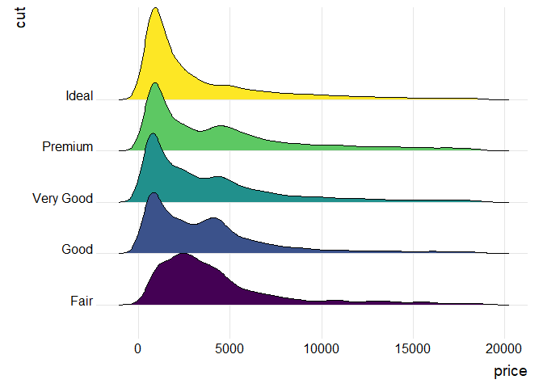
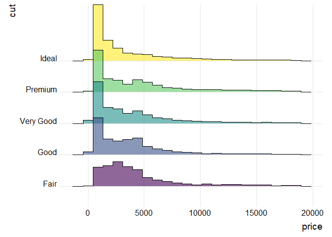
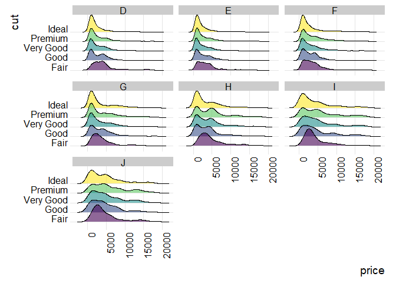

R-ggridges
================
Last compiled on Sun Apr 18 10:34:55 2021, PDT

## R-ggridges Introduction with `geom_density_ridges()`

### Load the data

``` r
# library
library(tidyverse)
library(ggridges) # Ridgeline Plots in ggplot2
library(ggplot2)
(diamonds)
```

    ## # A tibble: 53,940 x 10
    ##    carat cut       color clarity depth table price     x     y     z
    ##    <dbl> <ord>     <ord> <ord>   <dbl> <dbl> <int> <dbl> <dbl> <dbl>
    ##  1 0.23  Ideal     E     SI2      61.5    55   326  3.95  3.98  2.43
    ##  2 0.21  Premium   E     SI1      59.8    61   326  3.89  3.84  2.31
    ##  3 0.23  Good      E     VS1      56.9    65   327  4.05  4.07  2.31
    ##  4 0.290 Premium   I     VS2      62.4    58   334  4.2   4.23  2.63
    ##  5 0.31  Good      J     SI2      63.3    58   335  4.34  4.35  2.75
    ##  6 0.24  Very Good J     VVS2     62.8    57   336  3.94  3.96  2.48
    ##  7 0.24  Very Good I     VVS1     62.3    57   336  3.95  3.98  2.47
    ##  8 0.26  Very Good H     SI1      61.9    55   337  4.07  4.11  2.53
    ##  9 0.22  Fair      E     VS2      65.1    61   337  3.87  3.78  2.49
    ## 10 0.23  Very Good H     VS1      59.4    61   338  4     4.05  2.39
    ## # ... with 53,930 more rows

### Visualization part

#### Basic plot

``` r
diamonds %>% 
  ggplot(aes(x = price, y = cut, fill = cut))+
  geom_density_ridges()+
  theme_ridges()+
  theme(legend.position = 'none')
```

<!-- -->

> Ideal cuts do not neccessarily have higher price. Why is that?
> Shouldn’t that be the better cuts, the higher price?

#### Change to histogram with `stat='binline', bins=22, alpha=0.6`

``` r
diamonds %>% 
  ggplot(aes(x = price, y = cut, fill = cut))+
  geom_density_ridges(alpha=.6, stat = 'binline', bins=22)+
  theme_ridges()+
  theme(legend.position = 'none')
```

<!-- -->

#### Facet by the third variable (`facet_wrap()`)

``` r
diamonds %>% 
  ggplot(aes(x = price, y = cut, fill = cut))+
  geom_density_ridges(alpha=.6)+
  facet_wrap(~color)+
  theme_ridges()+
  theme(legend.position = 'none')+
  theme(axis.text.x = element_text(angle = 90, hjust = 1))
```

<!-- -->
